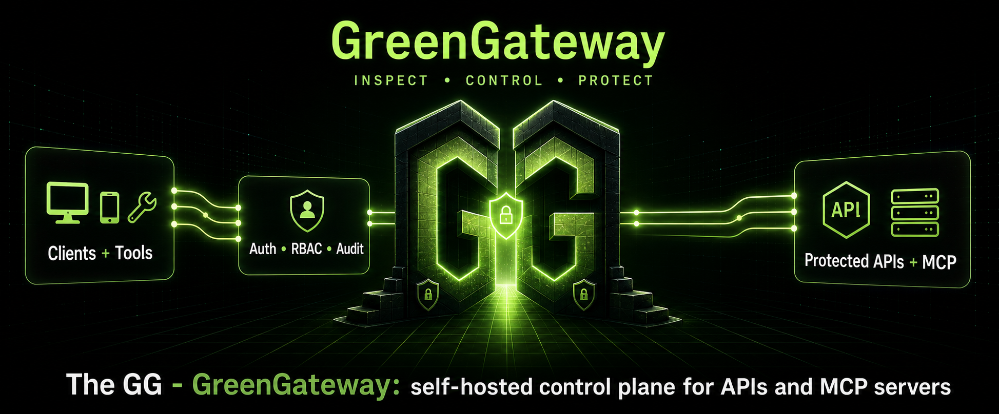

<div align="center">



# GreenGateway (GG)

### Open-source security gateway for APIs, MCP servers, and AI-agent traffic

[](LICENSE)
[](#project-status)
[](gateway)
[](#mcp-support)
[](CONTRIBUTING.md)

**Put authentication, RBAC, audit logs, traffic discovery, visual firewall rules, shadow mode, and egress controls in front of any API or MCP server.**

[Quick Start](#quick-start) | [Why GreenGateway](#why-greengateway) | [Demo](#demo-shadow-mode-for-api-firewall-rules) | [Use Cases](#use-cases) | [Features](#features) | [MCP Support](#mcp-support) | [Configuration](#configuration) | [Wiki](https://greenhatsec.com/green-gateway/wiki) | [Contributing](#contributing)

</div>

---

## Why GreenGateway?

AI agents, MCP clients, internal tools, and automation workflows are starting to call real business systems.

That creates a new security problem:

- Which human, bot, service account, or AI agent called this API?
- Which MCP tools should each identity be allowed to use?
- What happens if an agent tries to call an admin endpoint?
- Can you audit every request, decision, and outcome?
- Can you test new rules before blocking production traffic?
- Can you protect existing services without rebuilding every backend?

GreenGateway sits between clients and your APIs or MCP servers, learns how traffic is being used, and turns that traffic into enforceable, reviewable security controls.

```text
Client, bot, or AI agent
        |
        v
+-------------------------+
|      GreenGateway       |
|-------------------------|
| Auth                    |
| RBAC                    |
| Visual firewall rules   |
| Shadow mode             |
| Audit logs              |
| Traffic discovery       |
| Egress controls         |
| MCP proxying            |
+-------------------------+
        |
        v
Your API, service, or MCP server
```

## Demo: Shadow Mode for API Firewall Rules


GreenGateway can learn observed API traffic, draft a visual firewall rule from that traffic, run it in shadow mode, and preview the exact principals and requests that would be denied before enforcement is promoted.

## Quick Start

The fastest way to try GreenGateway is the seeded Docker Compose development stack.

It starts:

- GreenGateway
- Embedded admin UI
- Local JWKS fixture
- Seeded RBAC policy
- Internal echo upstream
- SQLite-backed audit storage
- Traffic-generator smoke test

```sh
docker compose -f docker-compose.yml -f docker-compose.dev.yml up --build
```

In another terminal:

```sh
curl http://localhost:8080/health
```

Expected response:

```json
{"status":"ok"}
```

Open the admin UI:

```text
http://localhost:8080/admin
```

Generate sample authenticated traffic:

```sh
node scripts/generate-traffic.mjs --smoke-test
```

The dev stack is self-contained. You do not need a real backend to test the gateway, admin UI, audit flow, rule builder, discovery features, or MCP surface.

## What GreenGateway Is

GreenGateway, GG for short, is an open-source, self-hosted security gateway for APIs and MCP servers.

It is designed for teams that want identity-aware controls, traffic visibility, audit logs, and visual policy management before exposing internal systems to humans, bots, service accounts, or AI agents.

GreenGateway can sit in front of:

- HTTP APIs
- Internal services
- MCP servers
- AI-agent tools
- Automation backends
- Developer or platform engineering services

It can run as a lightweight local gateway, a Docker Compose deployment, a containerized self-hosted service, or a Cloudflare Worker plus Container deployment.

## Use Cases

### Secure MCP Servers

Put GreenGateway in front of MCP servers so tools are not exposed directly to every client or agent.

Use it to control:

- Who can list tools
- Who can call specific tools
- Which tools are available to humans, bots, or agents
- Which outbound hosts tools are allowed to reach
- Which tool calls should be allowed, denied, shadowed, or audited

### Protect Internal APIs

Use GreenGateway as a security layer in front of existing HTTP APIs.

It can proxy traffic, observe endpoint usage, build an endpoint inventory, and help convert real traffic into identity-aware access rules.

### Roll Out API Firewall Rules Safely

Start in observe or shadow mode, review what would have been denied, and then promote rules once you are confident.

This helps teams move toward stricter access control without breaking valid traffic on day one.

### Audit AI and Automation Traffic

GreenGateway records who called what, which rule matched, what decision was made, and what happened.

This gives security, engineering, platform, and compliance teams a clearer view of human, bot, service account, and AI-agent activity.

## Features

| Area | What GreenGateway provides |
| --- | --- |
| Gateway server | Rust/axum gateway with health, version, metrics, proxy, admin, and MCP surfaces |
| Reverse proxy | HTTP proxying with upstream routing, header handling, request IDs, streamed responses, and latency tracking |
| Authentication | JWT/OIDC-style authentication, service tokens, cookie-session validation, and observe mode |
| Authorization | RBAC policy engine, direct firewall rules, deny-by-default support, hot reload, and shadow enforcement |
| Admin UI | Embedded React/TypeScript admin dashboard served from the gateway |
| Visual rule builder | Create, preview, reorder, enable, disable, and roll back rules without hand-editing JSON |
| Shadow mode | Test deny rules without blocking traffic, then promote them when ready |
| Audit logs | Queryable audit trail for requests, identities, policy decisions, and outcomes |
| Traffic discovery | Endpoint inventory, observed principals, traffic history, review state, and active rule coverage |
| Rule suggestions | Suggested allow, deny, and shadow rules based on observed traffic and anomaly signals |
| Identity directory | Directory of humans, bots, and service accounts that have traversed the gateway |
| MCP support | Native `/mcp` endpoint, tool registry, upstream MCP proxying, OpenAPI-to-tools, and MCP audit/discovery |
| Egress firewall | Outbound host allowlists, private IP protections, and SSRF-focused controls |
| Anomaly signals | Deterministic signals for new endpoints, schema mismatches, error spikes, new principal activity, and volume outliers |
| Policy history | Versioned policy changes, rollback, and audit trail |
| Cloudflare deployment | Worker plus Container deployment path for guided self-hosting on Cloudflare |
| Local dev harness | Checked-in JWKS/RBAC fixtures, Docker Compose stack, and sample traffic generator |

## MCP Support

GreenGateway includes native MCP support through a gateway-owned `/mcp` endpoint.

Current MCP capabilities include:

- MCP `initialize`
- `tools/list`
- `tools/call`
- Dynamic tool registry
- JSON Schema validation
- Upstream MCP server proxying
- OpenAPI-to-tools preview/register APIs
- MCP client conformance coverage
- MCP traffic discovery
- Rule-builder integration for MCP tool calls
- Audit coverage for MCP activity

This lets you apply the same identity, policy, audit, and traffic-review model to MCP tools that you use for HTTP APIs.

## Visual Rule Builder

GreenGateway includes a visual rule builder so operators do not need to hand-edit JSON policies for every change.

You can:

- View existing rules
- Create rules from observed traffic
- Drag and reorder rules
- Enable or disable rules
- Preview a rule against historical traffic
- Review rule hit counts
- Promote shadow rules into enforced rules
- Roll back policy versions

This is designed to make API and MCP security policy easier to review before enforcement.

## Shadow Mode

Shadow mode lets you test a rule without blocking traffic.

When a rule is set to shadow mode, GreenGateway records what would have been denied while still allowing the request.

Use shadow mode to:

- Validate new access rules
- Reduce rollout risk
- Understand blast radius before enforcement
- Build confidence before blocking production traffic
- Show security reviewers what enforcement would do before turning it on

## Audit and Discovery

GreenGateway records security-relevant activity so teams can answer:

- Who called this endpoint?
- Which identity, service account, bot, or agent was used?
- Which rule matched?
- Was the request allowed, denied, or shadowed?
- Which endpoints are new?
- Which principals are touching which APIs?
- Are there schema mismatches or unexpected calls?

The audit and discovery features are designed to support security reviews, incident response, compliance evidence, and day-to-day operations.

## Example Rollout

A typical GreenGateway rollout looks like this:

1. Put GreenGateway in front of an API or MCP server
2. Start in observe mode while real traffic flows through
3. Review discovered endpoints, callers, tools, and anomalies
4. Generate suggested rules from observed behavior
5. Preview rules against historical traffic
6. Enable rules in shadow mode
7. Review would-deny events
8. Promote safe rules to enforcement
9. Continue auditing and tuning over time

## GreenGateway vs Traditional API Gateways

Traditional API gateways are broad platforms for routing, load balancing, rate limiting, developer portals, API lifecycle management, plugins, and enterprise API operations.

GreenGateway is narrower by design.

It focuses on security workflows for APIs and MCP servers:

- Identity-aware access rules
- Traffic discovery before enforcement
- Visual rule building
- Shadow-mode rollout
- Audit trails for human, bot, service account, and agent traffic
- MCP tool governance
- Egress controls for tool calls

If you need a full enterprise API management platform, a mature gateway such as Kong may be a better fit.

If you need a focused, self-hosted security control plane for internal APIs, MCP servers, and AI-agent traffic, GreenGateway may be a better starting point.

## When to Use GreenGateway

GreenGateway may be useful if you are:

- Building with MCP servers
- Giving AI agents access to internal tools
- Exposing internal APIs to automation
- Trying to add audit logs in front of existing services
- Rolling out zero-trust controls for APIs
- Reviewing which identities can access which endpoints
- Building a safer control plane for bots, agents, and service accounts
- Looking for a lightweight self-hosted layer before adopting a broader API platform

## When Not to Use GreenGateway Yet

GreenGateway is alpha software.

Do not use it as your only production security control unless you have reviewed, tested, and hardened it for your own environment.

You should not assume GreenGateway is production-ready for:

- High-scale production traffic
- Regulated production environments
- Mission-critical enforcement
- Multi-instance production deployments
- Environments requiring formal vendor support

The current project is best suited for evaluation, demos, development environments, guided self-hosting, and early adopters who can review and test the code.

## Project Status

GreenGateway is in alpha.

The core gateway, admin UI, discovery, visual rule builder, native MCP support, identity/auth surface, and Cloudflare deployment path are implemented for evaluation and guided self-hosting.

The project is not production-hardened yet.

Current status:

| Area | Status |
| --- | --- |
| Core gateway | Implemented |
| HTTP reverse proxy | Implemented |
| Admin UI | Implemented |
| JWT/OIDC-style auth | Implemented |
| Service tokens | Implemented |
| RBAC and direct firewall rules | Implemented |
| Visual rule builder | Implemented |
| Shadow-mode review | Implemented |
| SQLite audit sink | Implemented |
| Traffic discovery | Implemented |
| Native MCP endpoint | Implemented |
| MCP tool registry and upstream proxying | Implemented |
| Egress firewall | Implemented |
| Anomaly signals | Implemented |
| Cloudflare deploy path | Implemented |
| Postgres audit sink for multi-instance deployments | Planned |
| Additional MCP follow-ups | Planned |

Progress is tracked in the pinned roadmap issue:

```text
https://github.com/Greenhat-Security/GreenGateway/issues/44
```

For setup, zero-trust rollout guidance, use cases, and operator reference docs, read the [GreenGateway wiki](https://greenhatsec.com/green-gateway/wiki).

## Run with Cargo

For local development, build and run the workspace:

```sh
cargo build --workspace
cargo run
```

Check the gateway:

```sh
curl http://localhost:8080/health
```

Expected response:

```json
{"status":"ok"}
```

Run on a different address:

```sh
LISTEN_ADDR=127.0.0.1:9090 cargo run
```

Local builds require Rust plus Node.js and npm on `PATH`, because `cargo build --workspace` builds and embeds the admin UI.

## Frontend Development

The admin UI is a Vite + React + TypeScript app embedded into the gateway binary.

For frontend development with hot reload, run the backend and frontend side by side.

Terminal 1:

```sh
cargo run
```

Terminal 2:

```sh
cd admin-ui
npm ci
npm run dev
```

Then open:

```text
http://127.0.0.1:5173/admin/
```

The Vite dev server proxies `/v1/admin` requests to `http://127.0.0.1:8080` by default.

To target a different backend:

```sh
GREENGATEWAY_BACKEND_URL=http://127.0.0.1:9090 npm run dev
```

## Docker Compose

Basic Docker Compose:

```sh
docker compose up --build
```

Seeded local development stack:

```sh
docker compose -f docker-compose.yml -f docker-compose.dev.yml up --build
```

The development stack includes JWT auth, RBAC, a JWKS sidecar, the embedded admin UI, an internal-only echo upstream, and queryable SQLite audit storage.

## Cloudflare Deploy

[](https://deploy.workers.cloudflare.com/?url=https://github.com/Greenhat-Security/GreenGateway)

This deploys a Cloudflare Worker that routes traffic to GreenGateway running inside a Cloudflare Container built from the existing `Dockerfile`.

Cloudflare Containers require a Workers Paid plan, and the first deploy can take a few minutes while Cloudflare builds and provisions the image.

See:

```text
docs/deployment/cloudflare.md
```

## Configuration

GreenGateway reads configuration from environment variables.

Common configuration areas include:

| Area | Examples |
| --- | --- |
| Server | `LISTEN_ADDR`, `ADMIN_PREFIX`, `ADMIN_LISTEN_ADDR` |
| Auth | `AUTH_PROVIDERS`, `JWT_JWKS_URL`, `JWT_ISSUER`, `JWT_AUDIENCE`, `AUTH_MODE` |
| RBAC | `POLICY_FILE`, `RBAC_EXEMPT_PATHS` |
| Proxy | `UPSTREAM_URL`, upstream routing settings |
| MCP | `GATEWAY_PUBLIC_URL`, `TOOLS_FILE`, `MCP_UPSTREAM_SERVERS`, `TOOL_RUNTIME_*` |
| Audit | `AUDIT_LOG_FILE`, `AUDIT_SQLITE_PATH`, `AUDIT_SQLITE_RETENTION_DAYS` |
| Discovery | `DISCOVERY_SQLITE_PATH`, schema and payload capture settings |
| Egress | `EGRESS_ALLOWED_HOSTS`, `EGRESS_DENY_PRIVATE_IPS` |
| Security | CORS, CSRF, rate limits, body validation, security headers |

See the full configuration reference:

```text
docs/configuration.md
```

Provider-specific auth recipes for Keycloak, Auth0, Microsoft Entra ID, and Okta live in:

```text
docs/auth/README.md
```

For real deployments that want to enable RBAC without immediately blocking unmatched traffic, start from:

```text
docs/examples/policy.starter.json
```

And read:

```text
docs/examples/policy.starter.README.md
```

The `docs/configuration.md` file and `.env.example` are kept in sync with the code by automated tests.

## Repository Structure

```text
.
|-- admin-ui/              # React/TypeScript admin UI
|-- cloudflare/            # Cloudflare Worker entrypoint and config helpers
|-- gateway/               # Rust gateway server
|-- docs/                  # Configuration, deployment, examples, and guides
|-- dev/                   # Local development fixtures
|-- scripts/               # Helper scripts and traffic generation
|-- docker-compose.yml
|-- docker-compose.dev.yml
|-- Dockerfile
|-- Cargo.toml
`-- README.md
```

## Roadmap

The project is moving toward a stronger v1 control plane for API and MCP security.

Planned focus areas include:

- Production hardening
- Multi-instance deployment support
- Postgres audit sink
- More MCP deployment patterns
- More rule templates
- More identity-provider recipes
- Better documentation and examples
- More end-to-end demo environments

See the pinned roadmap issue for active work:

```text
https://github.com/Greenhat-Security/GreenGateway/issues/44
```

## Contributing

Contributions are welcome.

Good first contribution areas include:

- Documentation improvements
- Example policies
- Deployment recipes
- Identity-provider setup guides
- MCP server examples
- UI/UX improvements
- Tests
- Security hardening
- Issue triage

Before opening a pull request, read:

```text
CONTRIBUTING.md
```

Security-relevant changes involving authentication, authorization, egress controls, audit behavior, secrets handling, policy evaluation, or admin permissions may require extra review.

Please report suspected vulnerabilities through the process described in:

```text
SECURITY.md
```

Do not open public GitHub issues for suspected security vulnerabilities.

## License

GreenGateway is open source under the Apache License 2.0.

You may use, copy, modify, merge, publish, distribute, sublicense, and sell copies of the software under the terms of the Apache License 2.0.

See:

```text
LICENSE
```

---

## Maintained By

GreenGateway is maintained by [Greenhat-Security](https://github.com/Greenhat-Security).

If you are building with AI agents, MCP servers, internal APIs, or automation workflows and want a self-hosted security control plane, try the dev stack and open an issue with feedback.

<div align="center">

[Issues](https://github.com/Greenhat-Security/GreenGateway/issues) | [Roadmap](https://github.com/Greenhat-Security/GreenGateway/issues/44) | [Wiki](https://greenhatsec.com/green-gateway/wiki)

</div>
