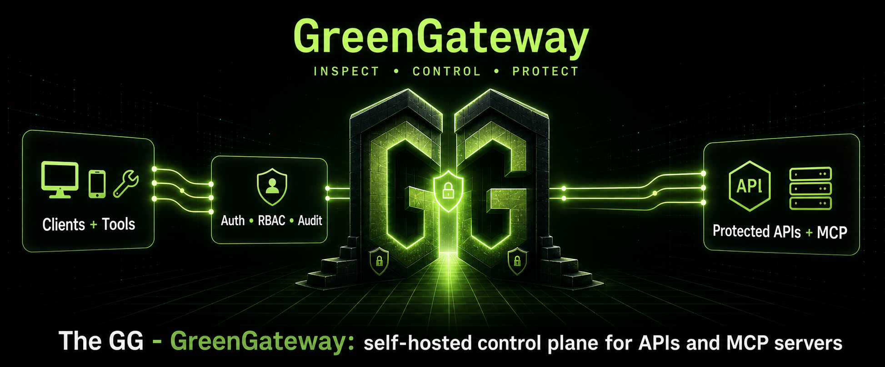

<div align="center">



# GreenGateway (GG)

### Open-source security gateway for APIs, MCP servers, and AI-agent traffic

[](LICENSE)
[](#project-status)
[](https://github.com/Greenhat-Security/GreenGateway/actions/workflows/ci.yml?query=branch%3Amain)
[](https://github.com/Greenhat-Security/GreenGateway/actions/workflows/nightly-performance.yml?query=branch%3Amain)
[](gateway)
[](#mcp-support)
[](CONTRIBUTING.md)

**Put authentication, RBAC, audit logs, traffic discovery, visual firewall rules, shadow mode, and egress controls in front of any API or MCP server.**

[Quick Start](#quick-start) | [Why GreenGateway](#why-greengateway) | [Demos](#demos) | [Use Cases](#use-cases) | [Features](#features) | [MCP Support](#mcp-support) | [Configuration](#configuration) | [Cloudflare Deploy](#cloudflare-deploy) | [Wiki](https://greenhatsec.com/green-gateway/wiki) | [Contributing](#contributing)

</div>

---

## Why GreenGateway?

AI agents, MCP clients, internal tools, and automation workflows are starting to call real business systems.

That creates a new security problem:

- Which human, bot, service account, or AI agent called this API?
- Which MCP tools should each identity be allowed to use?
- What happens if an agent tries to call an admin endpoint?
- Can you audit every request, decision, and outcome?
- Can you test new rules before blocking production traffic?
- Can you protect existing services without rebuilding every backend?

GreenGateway sits between clients and your APIs or MCP servers, learns how traffic is being used, and turns that traffic into enforceable, reviewable security controls.

```text
Client, bot, or AI agent
        |
        v
+-------------------------+
|      GreenGateway       |
|-------------------------|
| Auth                    |
| RBAC                    |
| Visual firewall rules   |
| Shadow mode             |
| Audit logs              |
| Traffic discovery       |
| Egress controls         |
| MCP proxying            |
+-------------------------+
        |
        v
Your API, service, or MCP server
```

## Demos

### Demo 1: Put an MCP Server Behind RBAC in 5 Minutes


GreenGateway can sit in front of MCP clients and servers, learn which tools are being called, and turn observed tool traffic into identity-aware rules. This demo shows Claude, Cursor, and GitHub MCP traffic flowing through the gateway, then blocks one risky tool for the GitHub automation identity while leaving normal MCP usage available.

### Demo 2: Shadow Mode for API Firewall Rules


GreenGateway can learn observed API traffic, draft a visual firewall rule from that traffic, run it in shadow mode, and preview the exact principals and requests that would be denied before enforcement is promoted.

### Demo 3: Stop an AI Agent from Calling Dangerous Internal Endpoints


GreenGateway can let an AI agent continue using normal business APIs while blocking dangerous internal or admin endpoints. This demo shows an agent attempting to call an admin role-change endpoint, GreenGateway denying it with an enforcing rule, and the live tail plus audit log preserving the actor, endpoint, matched rule, decision, status, and request ID.

## Quick Start

Choose the setup path that matches what you want to test.

### Option 1: Seeded Local Stack

The fastest local path is the seeded Docker Compose development stack.

It starts:

- GreenGateway
- Embedded admin UI
- Local JWKS fixture
- Seeded RBAC policy
- Internal echo upstream
- SQLite-backed audit storage
- Traffic-generator smoke test

```sh
docker compose -f docker-compose.yml -f docker-compose.dev.yml up --build
```

In another terminal:

```sh
curl http://localhost:8080/health
```

Expected response:

```json
{"status":"ok"}
```

Open the admin UI:

```text
http://localhost:8080/admin
```

Generate sample authenticated traffic:

```sh
node scripts/generate-traffic.mjs --smoke-test
```

The dev stack is self-contained. You do not need a real backend to test the gateway, admin UI, audit flow, rule builder, discovery features, or MCP surface.

### Option 2: One-click Cloudflare Deploy

[](https://deploy.workers.cloudflare.com/?url=https://github.com/Greenhat-Security/GreenGateway)

Use the Cloudflare deploy button when you want a hosted evaluation deployment instead of a local Docker Compose stack.

The one-click path creates a Cloudflare Worker that routes traffic to GreenGateway running inside a Cloudflare Container built from this repository's `Dockerfile`.

Requirements:

- Cloudflare account on a Workers Paid plan with Containers available
- Public GitHub or GitLab source repository
- A few minutes for the first container build and provisioning step

For the full deploy flow, runtime variables, and limitations, see [Cloudflare Deploy](#cloudflare-deploy).

## What GreenGateway Is

GreenGateway, GG for short, is an open-source, self-hosted security gateway for APIs and MCP servers.

It is designed for teams that want identity-aware controls, traffic visibility, audit logs, and visual policy management before exposing internal systems to humans, bots, service accounts, or AI agents.

GreenGateway can sit in front of:

- HTTP APIs
- Internal services
- MCP servers
- AI-agent tools
- Automation backends
- Developer or platform engineering services

It can run as a lightweight local gateway, a Docker Compose deployment, a containerized self-hosted service, or a Cloudflare Worker plus Container deployment.

## Use Cases

### Secure MCP Servers

Put GreenGateway in front of MCP servers so tools are not exposed directly to every client or agent.

Use it to control:

- Who can list tools
- Who can call specific tools
- Which tools are available to humans, bots, or agents
- Which outbound hosts tools are allowed to reach
- Which tool calls should be allowed, denied, shadowed, or audited

### Protect Internal APIs

Use GreenGateway as a security layer in front of existing HTTP APIs.

It can proxy traffic, observe endpoint usage, build an endpoint inventory, and help convert real traffic into identity-aware access rules.

### Roll Out API Firewall Rules Safely

Start in observe or shadow mode, review what would have been denied, and then promote rules once you are confident.

This helps teams move toward stricter access control without breaking valid traffic on day one.

### Audit AI and Automation Traffic

GreenGateway records who called what, which rule matched, what decision was made, and what happened.

This gives security, engineering, platform, and compliance teams a clearer view of human, bot, service account, and AI-agent activity.

## Features

| Area | What GreenGateway provides |
| --- | --- |
| Gateway server | Rust/axum gateway with health, version, metrics, proxy, admin, and MCP surfaces |
| Reverse proxy | Bounded weighted endpoint pools, health-aware selection, safe retries/circuits, request/SSE streaming, mTLS isolation, and graceful draining |
| Authentication | JWT/OIDC-style authentication, service tokens, cookie-session validation, and observe mode |
| Authorization | RBAC policy engine, direct firewall rules, deny-by-default support, hot reload, and shadow enforcement |
| Admin UI | Embedded React/TypeScript admin dashboard served from the gateway |
| Visual rule builder | Create, preview, reorder, enable, disable, and roll back rules without hand-editing JSON |
| Shadow mode | Test deny rules without blocking traffic, then promote them when ready |
| Audit logs | Queryable audit trail for requests, identities, policy decisions, and outcomes |
| Traffic discovery | Endpoint inventory, observed principals, traffic history, review state, and active rule coverage |
| Connections | Shared, revisioned HTTP/MCP destinations with opaque credential bindings, independent TLS profiles, multiple secret-backed request headers, safe tests, and managed discovery |
| Capability inventory | Policy-filtered, read-only view of manual, legacy, OpenAPI, and MCP capabilities with provenance and availability |
| Tool playground | Constrained execution of registered tools through the same policy, Connection, credential, TLS, egress, and audit path used at runtime |
| Rule suggestions | Suggested allow, deny, and shadow rules based on observed traffic and anomaly signals |
| Identity directory | Directory of humans, bots, and service accounts that have traversed the gateway |
| MCP support | Native `/mcp` endpoint, tool registry, upstream MCP proxying, OpenAPI-to-tools, and MCP audit/discovery |
| OpenAPI tool overlays | Versioned overlays, agent-facing request/response transforms, compensated composite tools, and runtime enum/label sources |
| Egress firewall | Outbound host allowlists, private IP protections, and SSRF-focused controls |
| Anomaly signals | Deterministic signals for new endpoints, schema mismatches, error spikes, new principal activity, and volume outliers |
| Policy history | Versioned policy changes, rollback, and audit trail |
| Cloudflare deployment | Worker plus Container deployment path for guided self-hosting on Cloudflare |
| Local dev harness | Checked-in JWKS/RBAC fixtures, three controllable Compose upstreams, correctness smoke scenarios, and load/soak scripts |

## MCP Support

GreenGateway includes native MCP support through a gateway-owned `/mcp` endpoint.

Current MCP capabilities include:

- MCP `initialize`
- `tools/list`
- `tools/call`
- Dynamic tool registry
- JSON Schema validation
- Upstream MCP server proxying
- OpenAPI-to-tools preview/register APIs
- MCP client conformance coverage
- MCP traffic discovery
- Rule-builder integration for MCP tool calls
- Audit coverage for MCP activity
- Managed streamable-HTTP MCP Connections with last-known-good catalogs
- Policy-filtered capability inventory and constrained playground execution
- Versioned OpenAPI overlays for generated-tool visibility, naming, and descriptions
- Bidirectional scalar/composite, exact decimal-micros, and Markdown/BlockNote transforms
- Ordered and fan-out composite tools with reverse-order compensation
- Runtime enum and label sources projected into `tools/list` with fail-closed call validation

This lets you apply the same identity, policy, audit, and traffic-review model to MCP tools that you use for HTTP APIs.

## Visual Rule Builder

GreenGateway includes a visual rule builder so operators do not need to hand-edit JSON policies for every change.

You can:

- View existing rules
- Create rules from observed traffic
- Drag and reorder rules
- Enable or disable rules
- Preview a rule against historical traffic
- Review rule hit counts
- Promote shadow rules into enforced rules
- Roll back policy versions

Write controls follow the gateway's permission response, including for service tokens and configured role mappings. After creating a rule, the editor keeps its returned ID and updates that same rule on later saves. The default-action banner distinguishes enforced denial from traffic forwarded in global shadow mode.

This is designed to make API and MCP security policy easier to review before enforcement.

## Shadow Mode

Shadow mode lets you test a rule without blocking traffic.

When a rule is set to shadow mode, GreenGateway records what would have been denied while still allowing the request.

Use shadow mode to:

- Validate new access rules
- Reduce rollout risk
- Understand blast radius before enforcement
- Build confidence before blocking production traffic
- Show security reviewers what enforcement would do before turning it on

The current rule preview and shadow review are operational rollout aids, not an authoritative whole-policy safety proof. Preview evaluates retained observations for a candidate rule; unavailable, incomplete, or unobserved traffic does not prove that a policy is safe. [Issue #243](https://github.com/Greenhat-Security/GreenGateway/issues/243) tracks the shared evaluator, bounded replay, complete simulation, and signed evidence work.

## Audit and Discovery

GreenGateway records security-relevant activity so teams can answer:

- Who called this endpoint?
- Which identity, service account, bot, or agent was used?
- Which rule matched?
- Was the request allowed, denied, or shadowed?
- Which endpoints are new?
- Which principals are touching which APIs?
- Are there schema mismatches or unexpected calls?

The audit and discovery features are designed to support security reviews, incident response, operator-defined evidence, and day-to-day operations. They do not by themselves provide compliance certification or prove that retained traffic is complete.

## Example Rollout

A typical GreenGateway rollout looks like this:

1. Put GreenGateway in front of an API or MCP server
2. Start in observe mode while real traffic flows through
3. Review discovered endpoints, callers, tools, and anomalies
4. Generate suggested rules from observed behavior
5. Preview rules against historical traffic
6. Enable rules in shadow mode
7. Review would-deny events
8. Promote safe rules to enforcement
9. Continue auditing and tuning over time

## GreenGateway vs Traditional API Gateways

Traditional API gateways are broad platforms for routing, load balancing, rate limiting, developer portals, API lifecycle management, plugins, and enterprise API operations.

GreenGateway is narrower by design.

It focuses on security workflows for APIs and MCP servers:

- Identity-aware access rules
- Traffic discovery before enforcement
- Visual rule building
- Shadow-mode rollout
- Audit trails for human, bot, service account, and agent traffic
- MCP tool governance
- Egress controls for tool calls

If you need a full enterprise API management platform, a mature gateway such as Kong may be a better fit.

If you need a focused, self-hosted security control plane for internal APIs, MCP servers, and AI-agent traffic, GreenGateway may be a better starting point.

## When to Use GreenGateway

GreenGateway may be useful if you are:

- Building with MCP servers
- Giving AI agents access to internal tools
- Exposing internal APIs to automation
- Trying to add audit logs in front of existing services
- Rolling out zero-trust controls for APIs
- Reviewing which identities can access which endpoints
- Building a safer control plane for bots, agents, and service accounts
- Looking for a lightweight self-hosted layer before adopting a broader API platform

## Production Use and Current Limits

GreenGateway is pre-GA alpha software with production-grade components. The core data plane, security boundaries, managed Connections, lifecycle controls, and bounded PostgreSQL cluster mode are implemented and extensively tested. The project does not yet publish a supported release line, SLA, or general-availability guarantee.

A controlled design-partner or internal production pilot can be reasonable when:

- GreenGateway is deployed as defense in depth rather than the only security control protecting mission-critical data.
- The exact image digest is pinned, the selected revision passes required CI and performance gates, and customer-shaped load and failure tests are run before traffic cutover.
- Multi-replica deployments follow the documented PostgreSQL boundary, use a managed or independently highly available database, and route only to readiness-approved replicas.
- The operator owns identity-provider policy, TLS, secret custody, database and key backups, monitoring, rollback, and incident response.
- Rollout begins with observe or shadow behavior, then moves through a canary before broader enforcement.

Do not currently treat GreenGateway as generally available for:

- Unreviewed high-scale or mission-critical enforcement.
- Regulated deployments that require a certified control or formal vendor assurance.
- Multi-instance operation outside the guarantees and non-goals in [`docs/deployment/postgres.md`](docs/deployment/postgres.md#supported-cluster-operation).
- Durable production operation through the one-click Cloudflare path; its container filesystem is ephemeral and that path remains evaluation-oriented.
- Environments requiring a maintained release line, contractual SLA, or formal vendor support.

For now, the appropriate production audience is a guided early adopter that can review the deployment, validate its own performance envelope, and operate a safe fallback.

## Project Status

GreenGateway is pre-GA alpha. Its core runtime is implemented; release, operator, and advanced policy-analysis maturity are still in progress. The latest tagged release is [`v1.0.1`](https://github.com/Greenhat-Security/GreenGateway/releases/tag/v1.0.1), while `main` contains substantial newer work. Do not deploy a floating `latest` tag: pin and validate an exact image digest.

Current status:

| Area | Status |
| --- | --- |
| Core gateway | Implemented |
| HTTP reverse proxy | Implemented |
| Release and support maturity | Pre-GA; no maintained release line or SLA yet, and security fixes currently target `main` |
| Bounded production data plane | Implemented; required CI, nightly performance, and customer-topology thresholds remain release gates |
| Admin UI | Implemented |
| JWT/OIDC-style auth | Implemented |
| Service tokens | Implemented |
| Managed Connections | Implemented for HTTP API and streamable-HTTP MCP destinations, including conditional CRUD, immutable runtime snapshots, and read-only legacy projections |
| Connection credentials and TLS | Implemented for operator environment/file aliases, encrypted local secrets, header API keys, static bearer tokens, OAuth client credentials, custom roots, and mTLS |
| Connection discovery and tests | Implemented for bounded stored tests plus last-known-good OpenAPI and MCP catalog refresh |
| Capability inventory and playground | Implemented with policy-filtered read-only inventory, strong execution preconditions, bounded requests/results, and no arbitrary URL/header/TLS overrides |
| RBAC and direct firewall rules | Implemented |
| Visual rule builder | Implemented; current preview is per-rule historical matching, not whole-policy simulation |
| Shadow-mode review | Implemented; authoritative replay, completeness semantics, and evidence hardening remain in #243 |
| SQLite audit sink | Implemented |
| Traffic discovery | Implemented |
| Native MCP endpoint | Implemented |
| MCP tool registry and upstream proxying | Implemented |
| OpenAPI generated-tool overlays | Implemented with versioned publication, transforms, compensated composites, dynamic enum/label sources, and no-overlay compatibility |
| Egress firewall | Implemented |
| Anomaly signals | Implemented |
| Cloudflare deploy path | Implemented for evaluation and guided self-hosting; durable production state is not provided by the ephemeral container filesystem |
| Multi-instance cluster mode (PostgreSQL) | Implemented; see [docs/deployment/postgres.md](docs/deployment/postgres.md#supported-cluster-operation) for the proved guarantees and the non-goals |
| Durable audit event store and cross-replica SSE stream | Implemented as a store, a stream and a projector source |
| Postgres audit sink for multi-instance deployments | Implemented; in cluster mode every serving replica writes its audit events to `greengateway.audit_events` off the request path, and that table is the audit of record — see [the proved guarantee](docs/deployment/postgres.md#what-the-gate-proves) |
| Operator setup and configuration lifecycle | Environment-driven operation is implemented; secure setup, versioned bundles, semantic plan/apply, and `ggctl` are tracked in #242 |
| Authoritative Policy Studio | Rulebase, builder, shadow review, history, and rollback are implemented; shared simulation, replay, optimizer, and signed evidence are tracked in #243 |

The original phases 1–7 roadmap is complete in [issue #44](https://github.com/Greenhat-Security/GreenGateway/issues/44). Current pre-GA work is tracked by the two remaining epics:

- [#242 — secure setup, operator CLI, and versioned configuration bundles](https://github.com/Greenhat-Security/GreenGateway/issues/242)
- [#243 — authoritative Policy Studio simulation, replay, optimization, and evidence](https://github.com/Greenhat-Security/GreenGateway/issues/243)

For setup, zero-trust rollout guidance, use cases, and operator reference docs, read the [GreenGateway wiki](https://greenhatsec.com/green-gateway/wiki).

Managed Connections are an authority boundary, not an authorization grant.
Every invocation is still authenticated and policy-checked before Connection
provider, DNS, or upstream work. The destination is then validated and
exact-pinned, TLS is prepared, the credential is resolved, and the configured
credential is injected only after caller credentials have been stripped. See
[the architecture](docs/architecture.md#managed-connection-boundary) for the
per-lane order and queued-revocation semantics.

## Run with Cargo

For local development, build and run the workspace:

```sh
cargo build --workspace
cargo run
```

Check the gateway:

```sh
curl http://localhost:8080/health
```

Expected response:

```json
{"status":"ok"}
```

Run on a different address:

```sh
LISTEN_ADDR=127.0.0.1:9090 cargo run
```

Local builds require Rust plus Node.js and npm on `PATH`, because `cargo build --workspace` builds and embeds the admin UI.

## Frontend Development

The admin UI is a Vite + React + TypeScript app embedded into the gateway binary.

For frontend development with hot reload, run the backend and frontend side by side.

Terminal 1:

```sh
cargo run
```

Terminal 2:

```sh
cd admin-ui
npm ci
npm run dev
```

Then open:

```text
http://127.0.0.1:5173/admin/
```

The Vite dev server proxies `/v1/admin` requests to `http://127.0.0.1:8080` by default.

To target a different backend:

```sh
GREENGATEWAY_BACKEND_URL=http://127.0.0.1:9090 npm run dev
```

## Docker Compose

Basic Docker Compose:

```sh
docker compose up --build
```

Seeded local development stack:

```sh
docker compose -f docker-compose.yml -f docker-compose.dev.yml up --build
```

The development stack includes JWT auth, RBAC, a JWKS sidecar, the embedded
admin UI, three weighted internal-only echo upstreams, active health/readiness,
safe GET retry probes, and queryable SQLite audit storage.

Run the multi-upstream correctness scenario:

```sh
node scripts/verify-dev-pool.mjs healthy
```

Add the load overlay before running the short load harness so the measurement
is not dominated by the intentional default ingress limiter:

```sh
docker compose -f docker-compose.yml -f docker-compose.dev.yml -f docker-compose.load.yml up -d
npm run load:quick
```

Deployment probes, migration, rollback, Kubernetes, metrics, and load/soak
guidance live in
[docs/deployment/production-data-plane.md](docs/deployment/production-data-plane.md).

Transparent gRPC proxying over HTTP/2 is available on an opt-in third listener (`GRPC_LISTEN_ADDR`, unset by default) with a per-route policy block. It supports unary, server-streaming, client-streaming, and bidirectional calls, and runs the same authentication, rate-limiting, RBAC, and egress boundaries as every other request. See [docs/deployment/grpc.md](docs/deployment/grpc.md); note that gRPC cannot work on Cloudflare Containers, for the reasons that guide states.

Pool migration is additive. An existing route can keep
`"upstream_url":"https://payments.example.test"` unchanged, or opt in one route
at a time by assigning stable IDs:

```json
{
  "id": "payments",
  "path_prefix": "/payments",
  "upstreams": [
    {"id": "payments-a", "url": "https://payments-a.example.test", "weight": 3},
    {"id": "payments-b", "url": "https://payments-b.example.test", "weight": 1}
  ],
  "load_balancing": {"strategy": "weighted_round_robin"}
}
```

Buffered bodies and one total attempt remain the defaults. Health, retries,
circuits, streamed uploads, SSE, and mTLS require explicit route/endpoint
configuration.

## Cloudflare Deploy

[](https://deploy.workers.cloudflare.com/?url=https://github.com/Greenhat-Security/GreenGateway)

The one-click deploy button creates a Cloudflare Workers application backed by a Cloudflare Container.

The Worker entrypoint lives in `cloudflare/src/index.ts`. The container image is built from the repository `Dockerfile`.

### Requirements

- Cloudflare account on a Workers Paid plan with Containers available
- Public GitHub or GitLab source repository, because Cloudflare Deploy buttons do not support private source repositories
- Docker or another Docker-compatible engine for manual deploys from your own machine

### What Cloudflare Creates

Wrangler uses `wrangler.jsonc` as the deployment source of truth.

It defines:

- Worker name: `greengateway`
- Worker entrypoint: `cloudflare/src/index.ts`
- Container class: `GreenGatewayContainer`
- Durable Object binding: `GREENGATEWAY_CONTAINER`
- Container image: `./Dockerfile`
- Preview URLs enabled for PR and version previews

The Worker sends every request to a singleton GreenGateway container on port `8080`. `LISTEN_ADDR` is forced to `0.0.0.0:8080` so the Cloudflare container supervisor can reach the gateway.

### Runtime Defaults

The default Cloudflare deploy is intentionally conservative.

| Variable | Default |
| --- | --- |
| `AUTH_ENABLED` | `true` |
| `AUTH_MODE` | `required` |
| `AUTH_EXEMPT_PATHS` | unset; defaults to probe paths plus the effective `ADMIN_PREFIX` |
| `RBAC_EXEMPT_PATHS` | unset; defaults to probe paths plus the effective `ADMIN_PREFIX` |
| `ADMIN_PREFIX` | `/admin` |
| `EGRESS_DENY_PRIVATE_IPS` | `true` |
| `UPSTREAM_URL` | blank by default |

Set `UPSTREAM_URL` or `UPSTREAM_ROUTES` during deploy, or later in the
Cloudflare dashboard, when you want GreenGateway to proxy to origin APIs.

After the first deploy, set `GATEWAY_PUBLIC_URL` to the deployed Worker URL if you use MCP OAuth protected-resource metadata.

The Cloudflare wrapper forwards non-empty string Worker variables and secrets whose names match GreenGateway configuration keys from `.env.example`, except:

- `LISTEN_ADDR`, because Cloudflare must reach the container on port `8080`
- `ADMIN_LISTEN_ADDR`, because this one-click Worker exposes a single container port
- the inbound TLS settings (`TLS_CERT_FILE`, `TLS_KEY_FILE`, `ADMIN_TLS_CERT_FILE`, `ADMIN_TLS_KEY_FILE`, `TLS_MIN_VERSION`, `TLS_HANDSHAKE_TIMEOUT_MS`, `TLS_MAX_CONCURRENT_HANDSHAKES`), because Cloudflare terminates TLS at its edge and reaches the container over plain HTTP/1.1

Keep secrets such as OIDC client secrets in Worker secrets or inside a secret-backed `AUTH_PROVIDERS` value. Do not commit them to the repository.

### Check the Deployment

After Cloudflare finishes provisioning, check the deployed gateway:

```sh
curl https://<worker-name>.<your-workers-subdomain>.workers.dev/startupz
curl https://<worker-name>.<your-workers-subdomain>.workers.dev/readyz
```

Expected response:

```json
{"status":"started"}
{"status":"ready"}
```

The embedded admin UI is available at:

```text
https://<worker-name>.<your-workers-subdomain>.workers.dev/admin
```

### Manual Deploy

If you are deploying from your own machine:

```sh
npm install
npx wrangler login
npm run deploy
```

### Important Limitations

- Cloudflare Containers use an ephemeral container filesystem by default. SQLite-backed evaluation settings can work for demos, but they are not durable storage across container replacement.
- File-backed settings such as `POLICY_FILE`, `TOOLS_FILE`, and `OPENAPI_SPEC_PATH` must point at files that exist inside the image or are created at runtime.
- Treat the one-click deploy path as a fast evaluation path for the current pre-GA release, not a production hardening guide.
- The first container deploy may return Worker errors for several minutes while Cloudflare finishes provisioning container capacity.

Full guide: [docs/deployment/cloudflare.md](docs/deployment/cloudflare.md)

## Configuration

GreenGateway reads configuration from environment variables.

Common configuration areas include:

| Area | Examples |
| --- | --- |
| Server | `LISTEN_ADDR`, `ADMIN_PREFIX`, `ADMIN_LISTEN_ADDR` |
| Inbound TLS | `TLS_CERT_FILE`, `TLS_KEY_FILE`, `ADMIN_TLS_CERT_FILE`, `ADMIN_TLS_KEY_FILE`, `TLS_MIN_VERSION` |
| Auth | `AUTH_PROVIDERS`, `JWT_JWKS_URL`, `JWT_ISSUER`, `JWT_AUDIENCE`, `AUTH_MODE` |
| RBAC | `POLICY_FILE`, `RBAC_EXEMPT_PATHS` |
| Proxy | `UPSTREAM_URL`, `UPSTREAM_ROUTES`, pool/health/retry/circuit/SSE/mTLS settings |
| MCP | `GATEWAY_PUBLIC_URL`, `TOOLS_FILE`, `MCP_UPSTREAM_SERVERS`, `TOOL_RUNTIME_*` |
| Connections | `CONNECTIONS_SQLITE_PATH`, `CONNECTION_SECRET_ALIASES`, `CONNECTION_SECRETS_ROOT`, `CONNECTION_LOCAL_SECRET_KEYRING` |
| State and HA | `STATE_BACKEND`, `DEPLOYMENT_ID`, `DATABASE_URL_FILE`, `DATABASE_TLS_MODE`, database pool and cluster settings |
| Audit | `AUDIT_LOG_FILE`, `AUDIT_SQLITE_PATH`, `AUDIT_SQLITE_RETENTION_DAYS` |
| Discovery | `DISCOVERY_SQLITE_PATH`, schema and payload capture settings |
| Egress | `EGRESS_ALLOWED_HOSTS`, `EGRESS_DENY_PRIVATE_IPS` |
| Security | CORS, CSRF, rate limits, body validation, security headers |

See the full configuration reference:

```text
docs/configuration.md
```

Provider-specific auth recipes for Keycloak, Auth0, Microsoft Entra ID, and Okta live in:

```text
docs/auth/README.md
```

For real deployments that want to enable RBAC without immediately blocking unmatched traffic, start from:

```text
docs/examples/policy.starter.json
```

And read:

```text
docs/examples/policy.starter.README.md
```

The `docs/configuration.md` file and `.env.example` are kept in sync with the code by automated tests.
Cloudflare's supported environment forwarding list is checked against the same
runtime reads, excluding only the forced `LISTEN_ADDR`, the unsupported split
`ADMIN_LISTEN_ADDR`, and the inbound TLS settings that a TLS-terminating edge
leaves nothing for the container to do.

Connection setup, safe migration, and control-plane operation are documented in:

- [Connection operator guide](docs/connections/operator-guide.md)
- [Connection migration and rollback](docs/connections/migration.md)
- [Connections and capability admin guide](docs/connections/admin-guide.md)
- [Issue #240 acceptance evidence](docs/testing/issue-240-acceptance.md)
- [Load-sensitive tests](docs/testing/load-sensitive-tests.md)

## Repository Structure

```text
.
|-- admin-ui/              # React/TypeScript admin UI
|-- cloudflare/            # Cloudflare Worker entrypoint and config helpers
|-- gateway/               # Rust gateway server
|-- docs/                  # Configuration, deployment, examples, and guides
|-- dev/                   # Local development fixtures
|-- scripts/               # Helper scripts and traffic generation
|-- docker-compose.yml
|-- docker-compose.dev.yml
|-- Dockerfile
|-- Cargo.toml
`-- README.md
```

## Roadmap

The original seven-phase product roadmap is complete. Current work is focused on the remaining pre-GA control-plane and operator guarantees:

- [Issue #242](https://github.com/Greenhat-Security/GreenGateway/issues/242): shared configuration compilation, secure initialization, `ggctl`, versioned bundles, semantic diff/risk, staging, activation, rollback, diagnostics, backup/restore, deployment rendering, and release packaging.
- [Issue #243](https://github.com/Greenhat-Security/GreenGateway/issues/243): one authoritative policy evaluator, server-side drafts, simulation, tests, bounded replay, conservative analysis, complete Policy Studio workflows, and deterministic signed evidence.

General-availability promotion additionally requires a green release candidate, customer-shaped load and recovery testing, a documented supported deployment envelope, and security-review remediation. Until then, documentation and release notes must describe GreenGateway as pre-GA and must not imply unsupported production, compliance, or support guarantees.

## Contributing

Contributions are welcome.

Good first contribution areas include:

- Documentation improvements
- Example policies
- Deployment recipes
- Identity-provider setup guides
- MCP server examples
- UI/UX improvements
- Tests
- Security hardening
- Issue triage

Before opening a pull request, read:

```text
CONTRIBUTING.md
```

Security-relevant changes involving authentication, authorization, egress controls, audit behavior, secrets handling, policy evaluation, or admin permissions may require extra review.

Please report suspected vulnerabilities through the process described in:

```text
SECURITY.md
```

Do not open public GitHub issues for suspected security vulnerabilities.

## License

GreenGateway is open source under the Apache License 2.0.

You may use, copy, modify, merge, publish, distribute, sublicense, and sell copies of the software under the terms of the Apache License 2.0.

See:

```text
LICENSE
```

---

## Maintained By

GreenGateway is maintained by [Greenhat-Security](https://github.com/Greenhat-Security).

If you are building with AI agents, MCP servers, internal APIs, or automation workflows and want a self-hosted security control plane, try the dev stack and open an issue with feedback.

<div align="center">

[Current Work](https://github.com/Greenhat-Security/GreenGateway/issues?q=is%3Aissue%20is%3Aopen) | [Completed Roadmap](https://github.com/Greenhat-Security/GreenGateway/issues/44) | [Wiki](https://greenhatsec.com/green-gateway/wiki)

</div>
