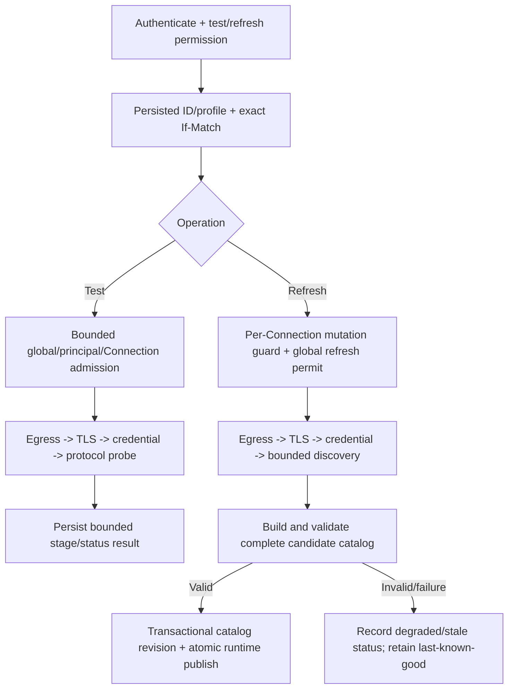
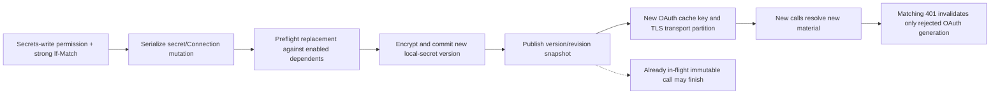
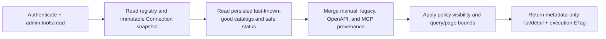

# GreenGateway Architecture

GreenGateway is alpha software. This document describes the security and
request-flow boundaries implemented on the current `main` branch. The ordering
below is a compatibility contract: a new route, provider, discovery adapter, or
availability feature must not create an outbound path around authentication,
authorization, egress validation, resource bounds, or audit.

## Inbound request lifecycle

The axum middleware stack and gateway-owned handlers enforce this logical order:

| Order | Layer | Responsibility |
| --- | --- | --- |
| 1 | Request ID and tracing | Correlate logs, observations, and audit events without trusting a spoofed identity header. |
| 2 | CORS and response hardening | Enforce configured origins and security headers. |
| 3 | Observation | Record one bounded terminal request observation and the inner auth/authz outcome that was reached. |
| 4 | Logical classification | Identify a stable route or gateway-owned surface using data only; no endpoint, DNS, client, provider, or socket work is available here. |
| 5 | IP/global rate limit and request validation | Bound pre-auth work, body size, and content type, and refuse `CONNECT` outright. Trusted forwarding headers are accepted only from configured proxy CIDRs. |
| 6 | CSRF | Protect cookie-authenticated control-plane writes; bearer-authenticated requests do not use the browser CSRF flow. |
| 7 | Authentication | Run the configured JWT/OIDC, service-token, or cookie-session validators and fail closed outside explicit exemptions. |
| 8 | Principal/policy rate limit | Apply identity-aware limits without changing the classified route. |
| 9 | RBAC, direct rules, and tool/admin policy | Evaluate the route, method/path, tool, and admin permission required by the selected surface. |
| 10 | Bounded handler admission | Acquire only the queue, concurrency, or lifecycle capacity owned by the already-authorized operation. |
| 11 | Immutable authority snapshot | Capture the configured route, tool definition, Connection revision, catalog revision, or strong ETag used by this invocation. |
| 12 | Egress and execution | Validate the physical destination and perform bounded network work using the lane-specific order below. |
| 13 | Response and terminal audit | Sanitize public failures and emit bounded outcome evidence. |

Audit is cross-cutting rather than a single final middleware. A layer emits an
event when it makes a security-relevant decision, and the request ID correlates
that evidence with the terminal observation.

```text
request
  -> logical classification only
  -> pre-auth limits and validation
  -> authentication
  -> principal limits
  -> RBAC / direct rule / tool or admin permission
  -> bounded handler and immutable authority
  -> egress-validated execution
  -> response

audit and observation are emitted throughout the path
```

## Production proxy data-plane boundary

The proxy classifies a configured logical route before authentication so policy
has a stable dispatch identity. Physical endpoint selection, DNS, client
acquisition, and forwarding remain in the fallback handler after the middleware
has allowed the request.

```text
stable logical route
  -> IP/global rate limit and request validation
  -> authentication and principal/policy rate limit
  -> RBAC and direct HTTP rules
  -> bounded pool admission
  -> eligible configured endpoint
  -> host/port policy + complete DNS validation + exact address pin
  -> bounded attempt(s)
  -> response and terminal observation
```

Pre-authorization classification cannot select an endpoint, resolve DNS,
acquire a client or permit, or open a socket. Weighted selection is based only
on configured pool state. Retries stay inside the authorized logical route,
share one deadline, and require a safe replayable method and body. See
[ADR-0005](adr/0005-production-proxy-data-plane.md).

## Managed Connection boundary

A Connection is a revisioned destination, credential binding, TLS profile,
timeout/test profile, and optional OpenAPI or streamable-HTTP MCP discovery
profile. It is not an authorization grant and it never changes the egress
allowlist.

When `CONNECTIONS_SQLITE_PATH` is configured, successful metadata mutations
commit transactionally and publish one immutable in-memory runtime snapshot.
Failed validation, provider preflight, transaction, TLS preparation, catalog
compile, or status write does not partially publish a candidate. When the store
is unset, projected legacy HTTP routes, the default HTTP upstream, and MCP
servers remain visible but read-only; managed mutations are unavailable and no
database is created implicitly.

All managed outbound lanes preserve this order:

1. authenticate, rate-limit, and authorize the stable logical operation;
2. capture an immutable Connection/definition/catalog authority snapshot;
3. apply scheme, host, and port egress policy;
4. resolve DNS, validate every returned address, and pin one exact accepted
   socket address while keeping hostname/SNI verification;
5. prepare the TLS/provider/client profile against that checked destination;
6. resolve a static secret or obtain an OAuth access token;
7. strip caller/configuration conflicts and inject the configured credential
   last; and
8. send bounded network bytes.

Redirects and ambient process proxies are disabled. Client arguments, headers,
bodies, OpenAPI `servers`, and discovered MCP metadata cannot replace a
configured Connection ID, origin, credential header, TLS profile, or token URL.

### Managed proxy route

```mermaid
flowchart LR
    A["Classify stable route"] --> B["Rate limit + authenticate + RBAC/direct rule"]
    B --> C["Bounded admission"]
    C --> D["Capture Connection revision and target"]
    D --> E["Validate scheme/host/port"]
    E --> F["Validate all DNS answers and exact-pin"]
    F --> G["Prepare TLS and partitioned client"]
    G --> H["Resolve static secret or OAuth token"]
    H --> I["Strip conflicts; inject credential last"]
    I --> J["Bounded upstream attempt"]
```



A Connection-bound proxy route has one configured `primary` destination.
Connection-owned timeouts and TLS apply to that route; pool health, retry,
circuit, and route timeout overrides are not combined with the managed target.
The logical authorization identity remains the configured route/Connection ID,
not a caller-selected URL.

### HTTP tools and admin playground

```mermaid
flowchart LR
    A["Authenticate + admin/tool permission"] --> B["Registered tool + execution ETag"]
    B --> C["Validate arguments and rendered method/path"]
    C --> D["Tool RBAC/direct HTTP rule + bounded queue"]
    D --> E["Capture definition and Connection revision"]
    E --> F["Playground: recheck live permission, ETag, rule, and revision"]
    F --> G["Egress + all-answer DNS + exact pin"]
    G --> H["Prepare TLS/client; resolve credential"]
    H --> I["Inject credential last and send"]
    I --> J["Bounded safe result projection"]
```



Manual and managed OpenAPI tools use typed HTTP mappings. The playground accepts
only an `arguments` object and a strong `If-Match` obtained from capability
detail; it has no URL, header, credential, TLS, method, or policy override.
After the runtime queue it rechecks the live `admin:tools:execute` permission,
the policy-filtered execution ETag, the rendered HTTP direct rule, and the
captured Connection/catalog revision before egress. Non-success HTTP bodies and
all HTTP response headers are withheld, unsupported/binary output fails closed,
and the projected result is capped at 64 KiB.

### Managed MCP execution

```mermaid
flowchart LR
    A["Authenticate MCP caller"] --> B["Tool visibility, RBAC/direct rule, and bounds"]
    B --> C["Capture typed MCP tool, catalog ETag, and Connection revision"]
    C --> D["Validate serialized MCP request size"]
    D --> E["Egress + all-answer DNS + exact pin"]
    E --> F["Prepare MCP TLS/client"]
    F --> G["Resolve credential or OAuth token"]
    G --> H["Inject credential per MCP HTTP request"]
    H --> I["Initialize/call/close within response and time bounds"]
```



The published tool binds a remote tool name to one Connection and catalog
revision. MCP server metadata, session headers, resource URIs, and tool
arguments cannot redirect the transport. Managed discovery and invocation use
the same checked-destination client. Credential rejection is mapped to a safe
category; an upstream `401` invalidates only the matching cached OAuth token
generation.

### Stored tests and last-known-good refresh



Tests use only the stored `GET`/`HEAD` profile (or the bounded MCP protocol
probe), accept no request body or target override, and have a ten-second
end-to-end deadline. Refresh uses only persisted discovery configuration,
accepts no request body, permits at most four concurrent refreshes globally and
one catalog mutation per Connection, and publishes all-or-nothing. A failed
refresh never replaces the prior catalog; inventory keeps that metadata visible
with stale/degraded status.

### Secret rotation and cache partitioning



Operator environment/file aliases are resolved on each authorized use. The
encrypted local provider versions values atomically and never reveals them.
Connection ETags, credential/TLS revisions, local-secret versions, egress
generation, and transport profile partition reusable clients and OAuth tokens.
TLS versions are read before and after material resolution; a concurrent change
fails that preparation rather than caching mixed material. Old cache entries
may remain bounded until eligible for replacement, but new calls cannot select
them under the new key.

### Read-only capability inventory



Inventory performs no secret resolution, OAuth exchange, DNS lookup, or
upstream request. It exposes typed provenance, schema, safe Connection identity,
availability, and policy-derived actions, but not secret bindings or values,
provider locators, TLS contents/fingerprints, tool arguments/results, or raw
upstream responses. Reading detail does not execute a tool.

### OAuth token endpoint is independent

The OAuth token URL is not assumed safe because the upstream Connection origin
passed egress. It has a separately partitioned `EgressClient` and independently
performs URL/scheme/host/port validation, complete DNS-answer validation, exact
pinning, TLS hostname/certificate verification, redirect denial, and 16 KiB
request/response bounds before the client secret is read or sent.

The upstream Connection's custom CA bundle and mTLS identity are deliberately
not inherited by the token client. The token cache key includes Connection ID,
Connection ETag, local encrypted-secret version when present, and token-client
egress generation. Tests do not share the detached data-plane token cache.

## Authorization, queueing, and revocation

“Denial has zero Connection/provider/network side effects” refers to a request
denied at its initial ingress, tool, or admin security gate. State can change
after a request has been authorized, so the exact boundary matters:

| Situation | Implemented behavior |
| --- | --- |
| Initial auth/RBAC/direct/tool/admin denial | Stops before Connection-specific store/provider reads, OAuth, DNS, client acquisition, or upstream bytes. |
| Playground permission, policy, ETag, direct rule, or Connection/catalog revision changes while queued | The post-queue execution precondition fails before provider, DNS, or upstream work and emits a safe rejection. |
| Stored test or refresh sees a different Connection ETag | The expected-revision target check fails before discovery/probe egress or before publish. |
| Ordinary proxy or MCP invocation was authorized under a policy snapshot and later waits for capacity | The existing invocation is not retroactively re-authorized; a later policy reload governs new invocations. |
| Connection/secret/policy changes after upstream bytes are dispatched | Already-sent bytes cannot be recalled. The in-flight call owns its captured material; new calls use the new revision/version. |

This is the explicit time-of-check/time-of-use model. Operators needing an
emergency hard stop should combine policy revocation with gateway drain or
upstream credential/network revocation.

## Destination and reusable transport flow

```text
configured URL
  -> scheme/host/port policy
  -> injectable resolver
  -> validate every IPv4/IPv6/mapped/NAT64 answer
  -> exact validated socket address
  -> cache key
       (origin + exact address + egress generation + timeouts
        + TLS roots + client identity + protocol/profile partition)
  -> bounded reused client with redirects and ambient proxies disabled
  -> hostname URL sent with SNI and certificate verification intact
```

The transport cache is sharded, bounded process-wide, and idle-expiring.
In-flight callers hold their own client reference. DNS is resolved and validated
for each new attempt; a cached client never substitutes for failed, empty,
mixed-safe/unsafe, or otherwise unsafe current DNS.

## Response, lifecycle, and shutdown

Ordinary response mode preserves the first-chunk commitment boundary. Explicit
SSE mode commits status and headers promptly, then streams with one-chunk
backpressure and independent idle, byte, duration, cancellation, and shutdown
limits. Payload bytes are not copied into terminal telemetry.

```text
running
  -> first termination signal
  -> readiness false; retry/health work cancelled
  -> bounded propagation delay
  -> listeners stop accepting; registered HTTP/SSE/background work drains
  -> hard request/background deadline
  -> terminal shutdown audit event
  -> audit admission closes; queued events and sinks flush
  -> process exit
```

`/livez` reports process liveness, `/startupz` required initialization, and
`/readyz` accepting-work plus required pool capacity. Probe handlers read cached
aggregate state and perform no synchronous network or durable-store work.

## Module ownership

The Cargo workspace currently contains the `gateway` binary crate. Its focused
modules include:

- `middleware/`, `auth/`, and `rbac/` for ingress limits, identity, policy,
  authorization, decision propagation, and terminal observation;
- `connections/` for the model, transactional store, immutable control-plane
  snapshots, safe admin views, secret providers, HTTP/TLS/OAuth preparation,
  tests, status, and OpenAPI/MCP catalogs;
- `egress.rs` and `egress/client_cache.rs` for SSRF policy, all-answer DNS
  validation, exact pinning, TLS identities, and bounded reusable transports;
- `proxy/` for logical classification, admission, health, retry, circuits,
  forwarding, streaming, and terminal telemetry;
- `tools/` and `mcp.rs` for typed capability definitions, inventory, constrained
  execution, OpenAPI, upstream MCP, and the gateway MCP protocol;
- `audit/` and `discovery/` for event delivery, durable queries, traffic
  inventory, and deterministic signals; and
- `lifecycle.rs` for probes, signal coordination, task/request tracking, and
  bounded shutdown.

`main.rs` composes those modules and owns the HTTP route surfaces. New outbound
HTTP must not be added outside `egress.rs`; CI enforces the primitive boundary
with `scripts/check-egress-only.sh`.

## Audit and diagnostic confidentiality

Security events use stable IDs, revisions, bounded action/outcome/reason values,
latency, counts, and invocation source. Public errors, admin DTOs, logs, metrics,
and audit payloads must not contain secret values or binding IDs that reveal
authority, environment/file locators, key IDs/paths, ciphertext/nonces, access
or refresh tokens, authorization/cookie headers, raw URL query/userinfo,
resolved addresses or DNS answers, raw resolver/TLS/transport errors,
certificate/private-key contents, tool arguments/results, MCP contents, or raw
upstream bodies/challenges.

The Connection threat model and residual risks are in
[ADR-0006](adr/0006-first-class-connections-and-credentials.md). Deployment and
operational details are in the [operator guide](connections/operator-guide.md),
[migration/rollback guide](connections/migration.md), [admin guide](connections/admin-guide.md),
and [issue #240 acceptance map](testing/issue-240-acceptance.md).
