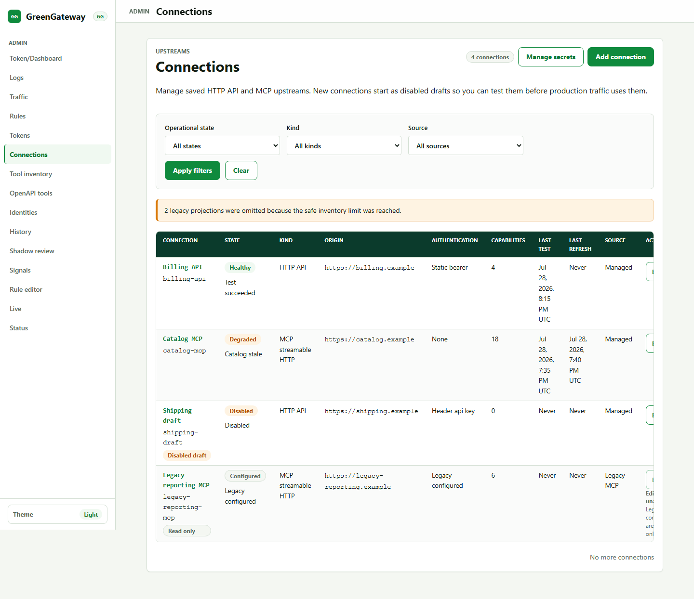
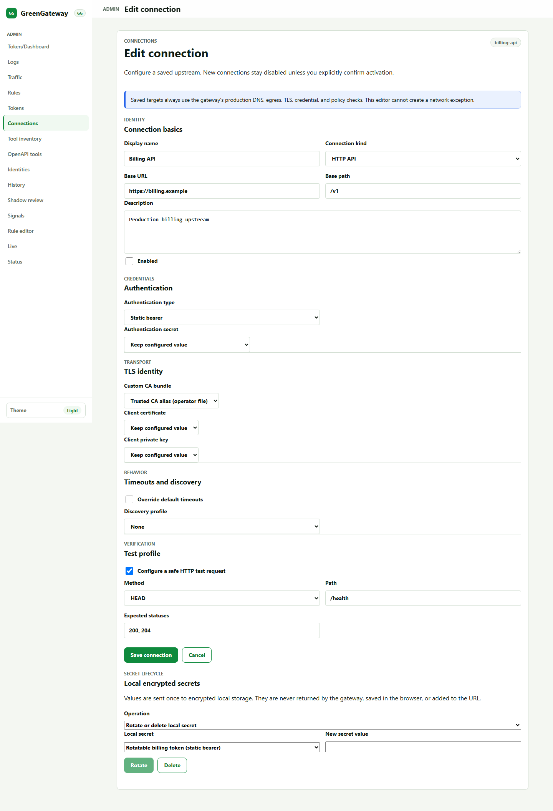
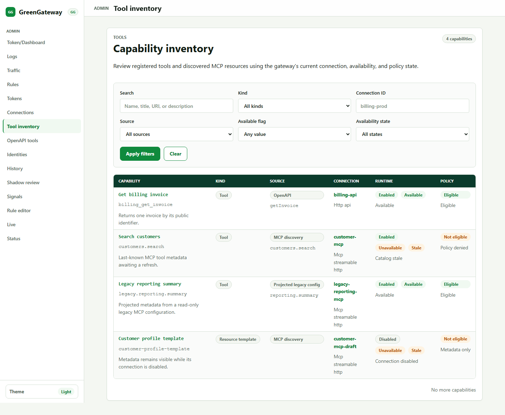
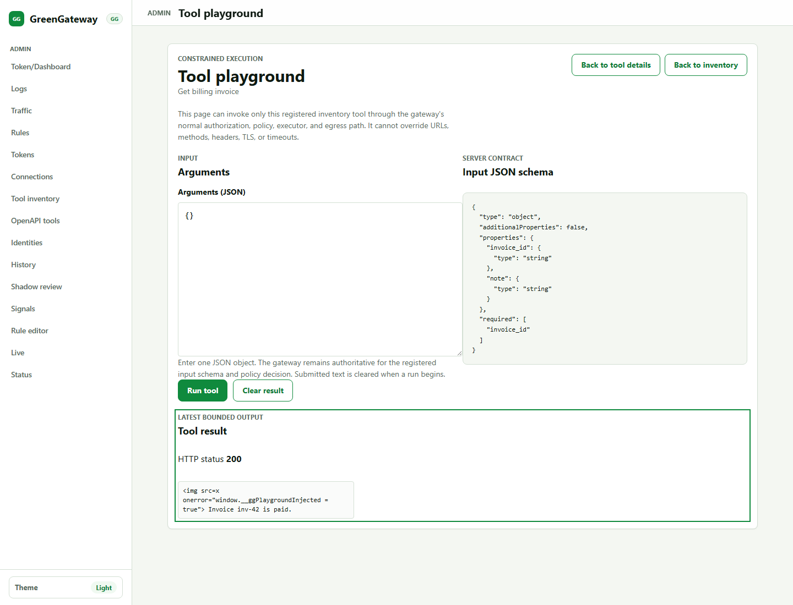

# Connections Admin Guide

The admin UI provides a redacted control plane for managed Connections,
capability inventory, and a constrained tool playground. It never reveals a
stored secret, provider locator, OAuth token, private key, certificate
contents, raw upstream error, tool argument, or rejected output.

Open the UI at `ADMIN_PREFIX` (default `/admin`). Its admin APIs use
`/v1{ADMIN_PREFIX}`. See the [operator guide](operator-guide.md) for production
custody and the [migration guide](migration.md) for legacy cutovers.

## Permissions

Server-issued actions in the UI reflect the current principal, resource state,
and management source. Hiding a button is convenience only; the server
rechecks permission and current state for every operation.

| Permission | UI authority |
|---|---|
| `admin:connections:read` | View redacted Connection list, detail, and status |
| `admin:connections:write` | Create, update, disable, enable, or delete managed non-sensitive configuration |
| `admin:connections:secrets:write` | List safe secret-alias metadata; create/rotate/delete local secrets; bind, replace, clear, or redirect credential/TLS authority |
| `admin:connections:test` | Run the saved bounded Connection test |
| `admin:connections:refresh` | Refresh an enabled managed OpenAPI or MCP catalog |
| `admin:tools:read` | View capability inventory and safe detail |
| `admin:tools:write` | Register selected managed OpenAPI tools |
| `admin:tools:execute` | Submit an eligible capability through the constrained playground |

Use separate operator roles for routine metadata edits, secret custody,
catalog administration, and tool execution. A connection writer without
secrets-write cannot redirect an existing credential to a different origin,
OAuth token URL, discovery target, or stored test target.

Reading the secret inventory is gated on `admin:connections:secrets:write`, not on `admin:connections:read`: `GET /v1{ADMIN_PREFIX}/connection-secrets` returns `403` to a Connection reader, so knowing which aliases exist stays with secret custody rather than with routine Connection reads. A role that should see the **Local encrypted secrets** panel needs secrets-write even when it will never submit a value.

## Connections

The **Connections** list combines managed records and read-only legacy
projections. Filter by enabled state, kind, source, or operational state. Each
row shows its immutable ID, safe origin summary, authentication kind, status,
capability count, and server-derived actions.

Legacy rows are labeled read-only. They come from `UPSTREAM_URL`,
`UPSTREAM_ROUTES`, or `MCP_UPSTREAM_SERVERS`; the UI cannot convert or edit
them. Use the [migration guide](migration.md) to create a separate managed
record and explicitly cut over its consumer.

When `CONNECTIONS_SQLITE_PATH` is unset, creating or changing managed
Connections is unavailable by design. Configure durable storage and restart
the gateway instead of trying to bypass the read-only state.

### Create or edit a Connection

Start new Connections disabled. Enter:

- a presentation name and optional description;
- `HTTP API` or `MCP streamable HTTP`;
- an HTTP(S) origin and origin-relative base path;
- authentication and protected bindings;
- independent custom-CA/mTLS bindings;
- bounded connection/request/idle timeouts;
- an optional saved test profile;
- managed OpenAPI or MCP discovery where applicable.

An enabled authenticated or TLS-bound Connection must be complete and its
protected material must validate. Disabled drafts may preserve an incomplete
binding so two-person or staged setup is possible, but supplied fields still
receive normal validation.

Saving a Connection does not add its host to egress policy and does not grant
any principal access. A route/tool binding plus normal policy and egress
authority are still required.

## Secret Bindings and Clearing

The editor lists only safe aliases compatible with each purpose. A saved
binding appears as **Configured**; its opaque ID is intentionally not returned
in Connection detail.

An existing binding has three explicit intents:

- **Keep configured value** preserves the hidden current binding.
- Selecting a safe alias replaces the binding.
- **Clear binding** removes the binding.

Clear is not a visual reset. It is a sensitive server mutation requiring
`admin:connections:secrets:write`, increments credential authority, and may
make an enabled candidate invalid. Disable a Connection when the intent is to
pause traffic; clear only when the protected association itself must be
removed.

The **Local encrypted secrets** panel accepts plaintext once for Create or
Rotate, clears the input from page state when submission starts, and receives
only redacted metadata in response. The value cannot be revealed again.
Automatic retry is intentionally avoided after an ambiguous mutation result.
Reload the secret inventory and determine the current version before deciding
whether to submit a new value.

Operator environment/file aliases cannot be created, rotated, or deleted in
the UI because their locators are trusted startup configuration. Local-secret
deletion is blocked while Connection dependencies remain; there is no force
delete.

## ETags and Concurrent Changes

The UI uses HTTP conditional requests to prevent one administrator from
overwriting another:

- a collection ETag protects Connection creation and local secret creation;
- a resource ETag protects Connection update, delete, Test, Refresh, and local
  secret rotation or deletion;
- mutation responses must return matching fresh version metadata before the UI
  enables another write.

`412 Precondition Failed` means the resource changed after this page loaded.
`428 Precondition Required` means an exact version was unavailable. Reload and
review the new state; do not copy the old form over it or blindly retry.

If the UI says an outcome is unknown, assume the operation may have succeeded.
Return to the list, reload safe metadata, and reconcile by immutable ID and
revision. This is especially important for secret Create/Rotate, where
repeating a request could store a different value or version.

## Test and Refresh

The Connection detail page can Test a managed Connection when the server marks
that action available. Test uses only the saved profile and shows bounded
stages such as egress policy, secret availability, connection, TLS,
authentication, and protocol validation. It never displays the target, IP,
headers, body, upstream status, OAuth challenge, or raw transport error.

A failed operational test is reported as a safe result and updates the
Connection's bounded status only if the tested ETag is still current. Fix the
stored configuration or deployment authority; there is no per-test URL,
header, credential, TLS, or egress override.

Refresh is available for an enabled managed discovery Connection. It publishes
only a complete valid catalog. On failure, a prior successful catalog remains
last-known-good and the page shows degraded/stale status with safe age/count
metadata. A stale catalog is not evidence that the latest upstream document
was partially accepted.

For OpenAPI, Preview requires tool-read authority and registration requires
tool-write authority plus explicit selection and any required security
confirmation. Name collisions fail instead of replacing an existing tool.

## Capability Inventory

**Inventory** merges manual tools, managed OpenAPI tools, managed MCP tools, and
legacy capabilities into one redacted view. Use filters for kind, source,
Connection ID, availability, and policy eligibility.

Detail shows:

- stable capability ID and public name;
- source and Connection provenance;
- availability/staleness and policy eligibility;
- safe HTTP mapping or remote MCP name;
- input JSON Schema;
- whether the constrained playground is available.

Inventory is descriptive, not an authorization grant. A capability may exist
but remain disabled, stale, metadata-only, blocked by Connection state, or
ineligible for the current principal.

## Tool Playground

The playground executes a registered capability through its real
GreenGateway definition. The operator supplies only one JSON object matching
the advertised schema. There is no arbitrary URL, method, header, credential,
TLS, connection ID, timeout, or redirect control.

Execution still enforces:

- `admin:tools:execute` at submission and again immediately before delayed
  execution;
- the tool's enabled state, role/issuer/auth-method policy, queue, concurrency,
  and timeout;
- Connection availability and immutable target binding;
- rendered HTTP direct-rule authorization where applicable;
- egress, DNS pinning, TLS, authentication, and response bounds.

The page clears submitted argument text when a run begins and does not retain
arguments after local validation or request failure. Results are bounded safe
HTTP or MCP projections. Unsafe or oversized output is rejected and not
displayed. Invocation audit events carry `invocation_source:
admin_playground`, but never arguments or results.

Treat every Run as a real upstream side effect. Use a purpose-built
non-production capability for experimentation, apply least privilege to
`admin:tools:execute`, and do not assume an HTTP method is safe merely because
the UI calls the feature a playground.

## Operational States

| State | Meaning and next action |
|---|---|
| `unknown` / `not_tested` | No current accepted observation; run the saved Test |
| `configured` | Saved configuration exists but has not established healthy status |
| `healthy` | Last accepted test/refresh succeeded for the current revision |
| `degraded` / `catalog_stale` | Refresh failed and last-known-good catalog remains; investigate age and safe reason |
| `unavailable` | No usable current result/catalog; inspect Test/Refresh and audit reasons |
| `disabled` | Production use is blocked; configure and Test before enabling |

Status is bounded operational evidence, not a public topology probe or an
authorization decision.

## Audit Review

After an admin operation, correlate its request ID with the audit explorer.
Expected event families include `connection.changed`,
`connection.credential_changed`, `connection.secret_changed`,
`connection.tested`, `connection.refreshed`, OAuth/secret-resolution outcomes,
and tool invocation events.

Escalate if an event contains a plaintext value, secret/provider locator,
credential header, token response, certificate body, tool argument/result,
upstream body, DNS answer, or raw error. Those values are outside the audit
contract.
